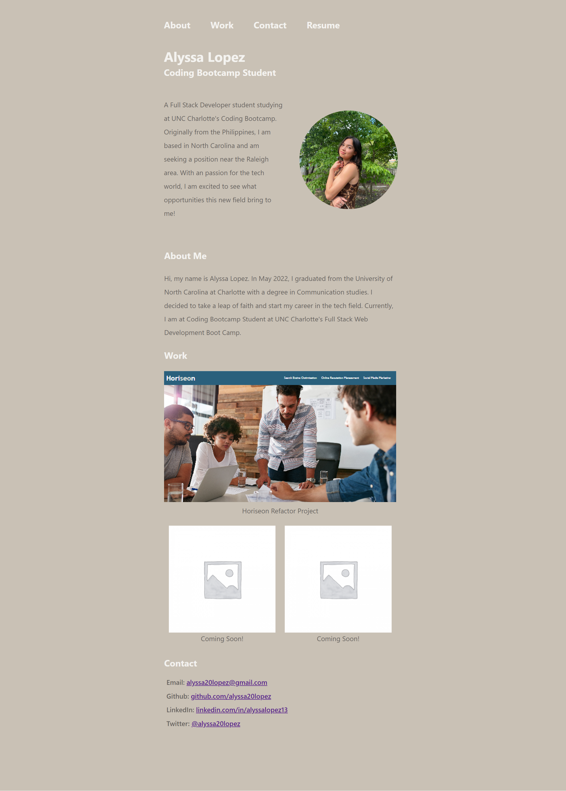

# advanced-css-portfolio

01-HTML-Git-CSS
## Table of Contents
1. [Description](#Description)
2. [Visuals](#visuals)

## Description
This website is a portfolio of my work as a coding bootcamp student. It features who I am, the work I have completed, contact information, and resume. In addition, this project feature my knowledge of flexbox, media queries, and CSS variables.

[Link to live site](https://alyssa20lopez.github.io/advanced-css-portfolio/)

## Visuals

